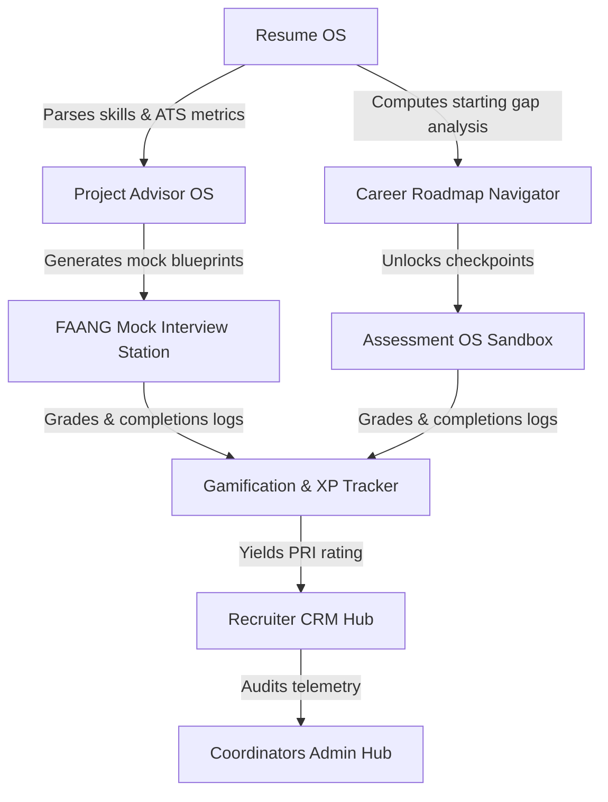

# Engineering Module Dependency Map

This document visualizes the dependencies, shared schemas, services, and components across BuggedBrain.

---

## 1. System Dependency Graph

The platform operates as a pipeline where downstream prep tools rely on profiles parsed upstream:

---

## 2. Shared Database Tables Matrix

To prevent RLS bypass conflicts and database locking, developers must review which modules read/write to the same tables:

| Database Table | Reader Modules | Writer Modules |
| :--- | :--- | :--- |
| **`public.profiles`** | All platform modules | Resume OS (on upload/builder edit), Admin |
| **`public.roadmap_progress`** | Career Navigator | Career Navigator (manual/auto checks) |
| **`public.student_projects`** | ProjectOS, Mock Interview Station | ProjectOS, Assessment OS validation |
| **`public.placement_readiness`** | Recruiter CRM, Leaderboard, CRM | Career Navigator, Mock rounds, Admin |
| **`public.user_xp`** | Header profiles indicators, Leaderboard | Missions OS, Community comments |

---

## 3. Shared AI Pipelines & Gateway Proxies

-   **Gateway Entry Point**: `generateResponse()` inside `lib/ai/router.ts`.
-   **Token Cache Service**: Redis caching keys (`ats:*`, `jd:*`, `roadmap:*`) shared across Resume OS, Job Matcher, and Career Navigator.
-   **RAG Engine**: Vector lookups (`lib/ai/rag.ts`) matching candidate experience listings to target company expectations (shared between Project OS stack advice and JD match analysis).
