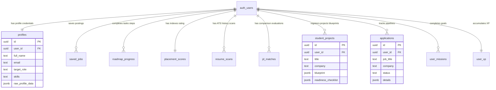
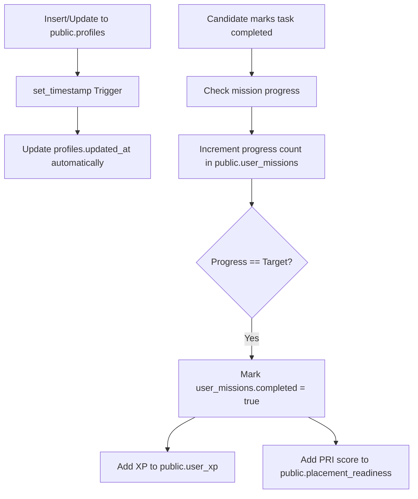
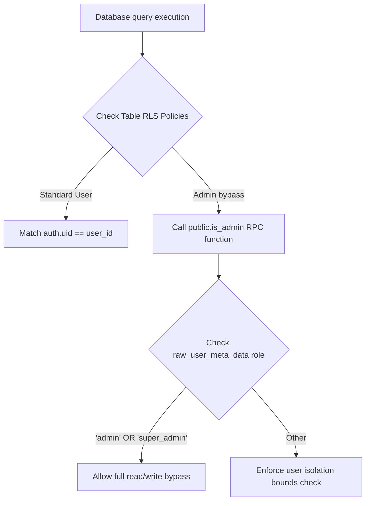

# Database Relationship & Security Diagrams

This directory visualizes database tables schemas, relational entities mapping, custom RPC functions, and database triggers.

---

## 1. Relational Entities Map (ER Diagram)

---

## 2. Trigger Flow Lifecycle

Database operations automatically propagate updates to telemetry and progress tables:

---

## 3. RPC & Database Function Flow

Custom SQL functions handle administrative overrides and security context validation:

---

## 4. Database Storage Buckets Security Map

-   **`resumes`**:
    - Folder: `resumes/`
    - Structure: `resumes/{user_id}/[filename].pdf`
    - RLS: Only user with `auth.uid() = user_id` can upload, modify, or read.
-   **`portfolio_assets`**:
    - Folder: `assets/`
    - Structure: `assets/{user_id}/[asset_id].png`
    - RLS: Authenticated users can insert; anyone can read to display UI images.
