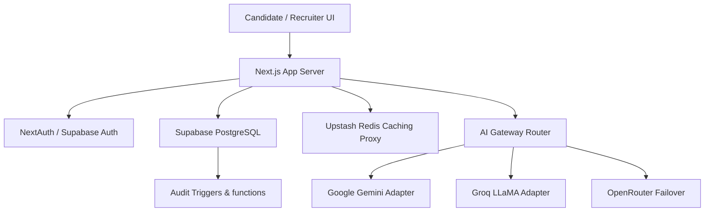
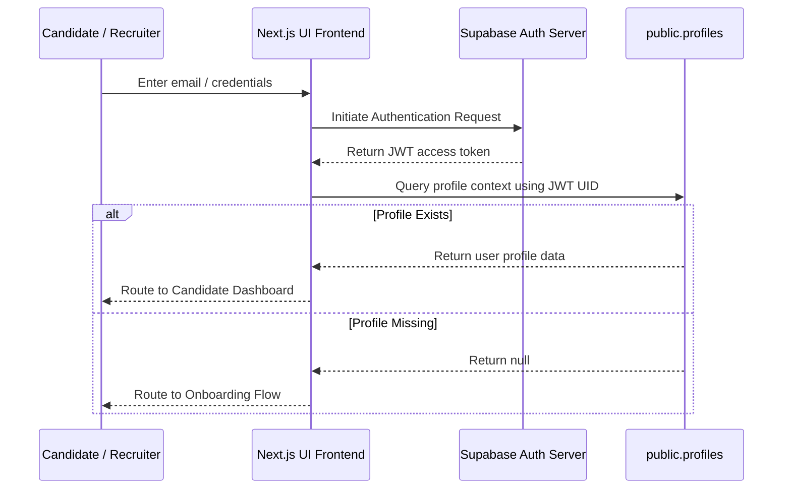
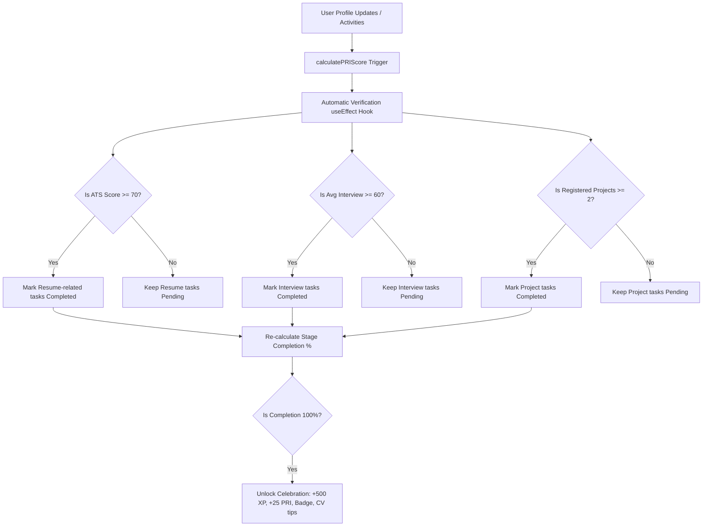
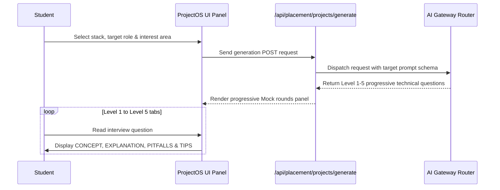
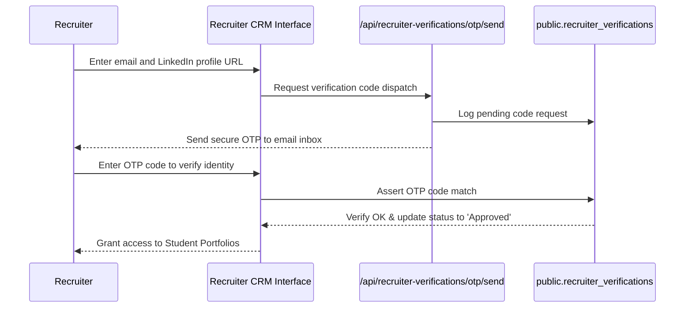

# Platform Visual Architectures & Life Cycles

This document visually maps the operations of BuggedBrain using Mermaid flowcharts.

---

## 1. Overall Platform Architecture Block Diagram



---

## 2. Authentication & Authorization Flow



---

## 3. Resume OS Evaluation Pipeline

```mermaid
graph LR
    Upload[Resume Upload (PDF/Docx)] --> Parser[Resume Parser Service]
    Parser --> Clean[Clean Raw Text]
    Clean --> Router[AI Gateway Router]
    Router --> CacheCheck{Redis Cache Lookup}
    
    CacheCheck -- Hit (Cost 0) --> Return[Display ATS & Gaps Score]
    CacheCheck -- Miss --> Gemini[Google Gemini-3.5-Pro]
    Gemini --> Cost[Log usage to public.analytics_events]
    Cost --> Save[Save to Redis Cache (TTL 24h)]
    Save --> Return
```

---

## 4. Career Roadmap Navigator Sync



---

## 5. Project Advisor OS & FAANG Mock Interview Engine



---

## 6. AI Router Caching & Failover Pipeline

```mermaid
graph TD
    Request[Incoming LLM prompt Request] --> Hash[Generate SHA-256 Hash of parameters]
    Hash --> Redis{Check Redis Cache Key}
    
    Redis -- Hit --> Return[Return cached response (Latency ~100ms, Cost $0)]
    Redis -- Miss --> Primary[Call Primary Google Gemini adapter]
    
    Primary -- Success --> CacheSave[Save response to Redis (TTL 24h)]
    CacheSave --> Return
    
    Primary -- Fail (429/503) --> FallbackGroq[Failover to Groq LLaMA provider]
    FallbackGroq -- Success --> Return
    FallbackGroq -- Fail --> FallbackOR[Failover to OpenRouter API provider]
    FallbackOR -- Success --> Return
    FallbackOR -- Fail --> Offline[Serve offline fallback template]
```

---

## 7. Recruiter CRM & Trust Portal


